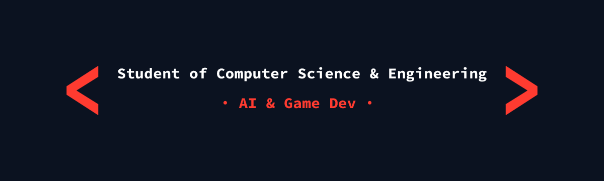

  

# 👋 Hi there! I'm Verenisse Cáceres (vef-am)

🎓 **Computer Science & Engineering student** at **UPC Barcelona** (final year).  
💻 Passionate about **Artificial Intelligence** and **Videogames**, with strong skills in **C++** and a quick-learning mindset.  
🦊 I believe in mixing professionalism with personality — because technology is also about creativity and inspiration.

---

## 🚀 About me
- 🤖 **My main goal:** create **AI to support human research in medicine** and help discover the unknown.  
- 🎮 Inspired by **RPG / open-world videogames**; I aim to design games that teach, move and entertain.  
- 🖥️ Quick learner: I’ve always stood out for understanding concepts fast.  
- 🎨 I also enjoy **digital art** and **3D modeling** as creative complements to my programming.

---

## 🛠️ Tech & Tools
**Languages:**  
C, C#, C++, Java, Python, HTML, CSS, SQL, PostgreSQL

**Tools & Frameworks:**  
Git/GitHub, Visual Studio Code, Unity, Blender

**Creative Side:**  
Clip Studio Paint (drawing), Blender (3D modeling)

💡 Strongest experience in **C++**, but continuously expanding into AI and Game Dev.

---

## 🧬 AI in Medicine
I want to build AI tools that help researchers explore data and accelerate discoveries in medicine — from supporting literature review and hypothesis generation to assisting experimental design.

---

## 📌 Projects
- 🌐 Currently working on my **portfolio website**.  
- 🎮 Future plans include projects combining **AI** and **videogames** for research and learning.

---

## 📊 Stats

  
   
   

### ✍️ Random Dev Quote

  

---

## 📫 Connect with me
  

---

  

✨ *“My dream is to create AI that helps humanity discover the unknown, and videogames that inspire and teach — just as games once inspired me.”*

---

# 👋 ¡Hola! Soy Verenisse Cáceres (vef-am)

🎓 Estudiante de **Ingeniería Informática** en la **UPC Barcelona** (último año).  
💻 Apasionado por la **Inteligencia Artificial** y los **Videojuegos**, con gran experiencia en **C++** y una fuerte capacidad de aprendizaje rápido.  
🦊 Creo en mezclar profesionalidad con personalidad — porque la tecnología también trata de creatividad e inspiración.

---

## 🚀 Sobre mí
- 🤖 **Mi meta principal:** crear **IA que apoye la investigación humana en medicina** y ayude a descubrir lo desconocido.  
- 🎮 Inspirado por **videojuegos RPG y de mundo abierto**; quiero diseñar juegos que enseñen, emocionen y entretengan.  
- 🖥️ Aprendiz rápido: siempre destaqué por comprender conceptos con facilidad.  
- 🎨 También disfruto del **arte digital** y el **modelado 3D** como complemento creativo a la programación.

---

## 🛠️ Tecnologías y Herramientas
**Lenguajes:**  
C, C#, C++, Java, Python, HTML, CSS, SQL, PostgreSQL

**Herramientas y Frameworks:**  
Git/GitHub, Visual Studio Code, Unity, Blender

**Parte creativa:**  
Clip Studio Paint (dibujo), Blender (modelado 3D)

💡 Mayor experiencia en **C++**, aunque sigo expandiéndome en IA y desarrollo de videojuegos.

---

## 📌 Proyectos
- 🌐 Actualmente trabajando en mi **web personal de portfolio**.  
- 🎮 Planes futuros incluyen proyectos que combinen **IA** y **videojuegos** tanto para **investigación** como para **diversión**.

---

## 📊 Estadísticas

  
   
   

---

## 📫 Contacto
  

---

  

✨ *“Mi sueño es crear IA que ayude a la humanidad a descubrir lo desconocido, y videojuegos que inspiren y enseñen — tal como los juegos me inspiraron a mí.”*

